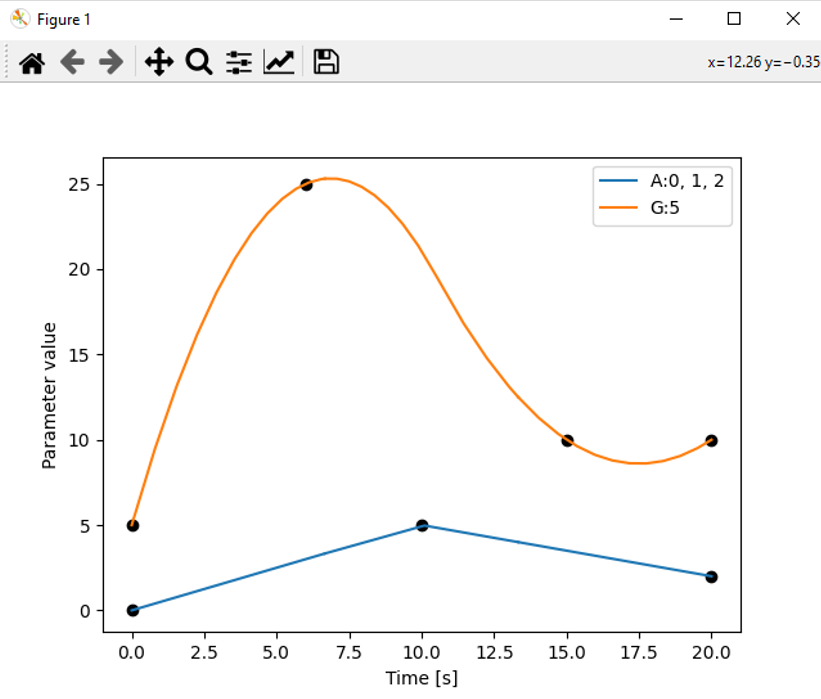
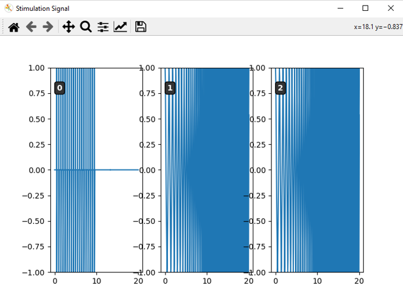
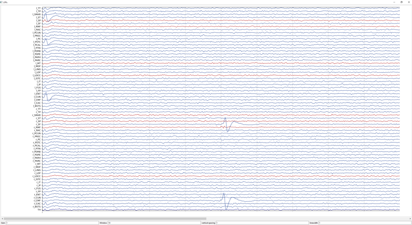
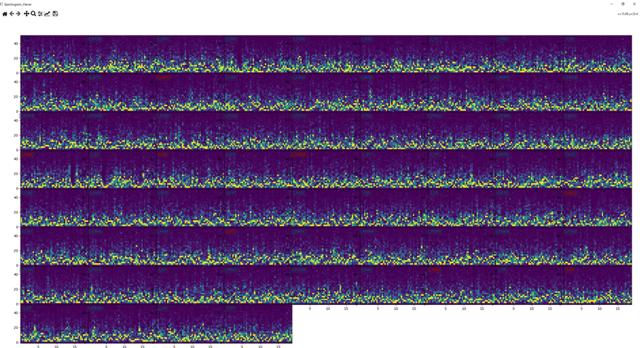
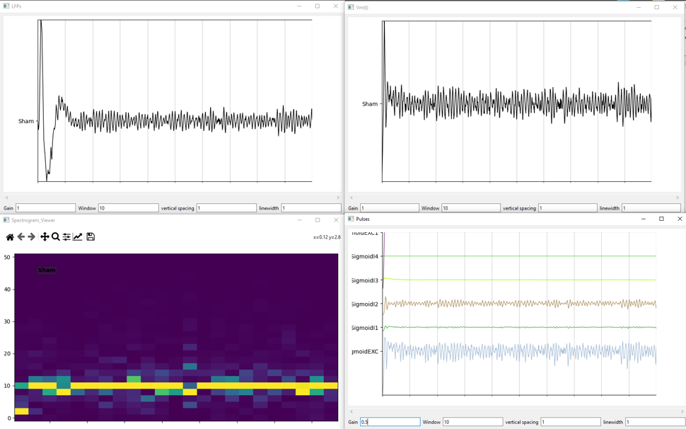
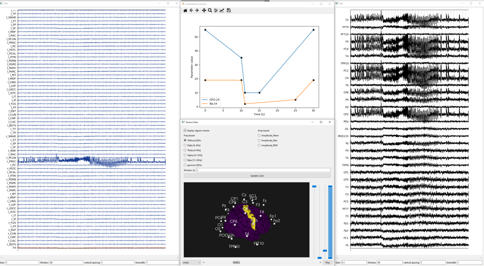
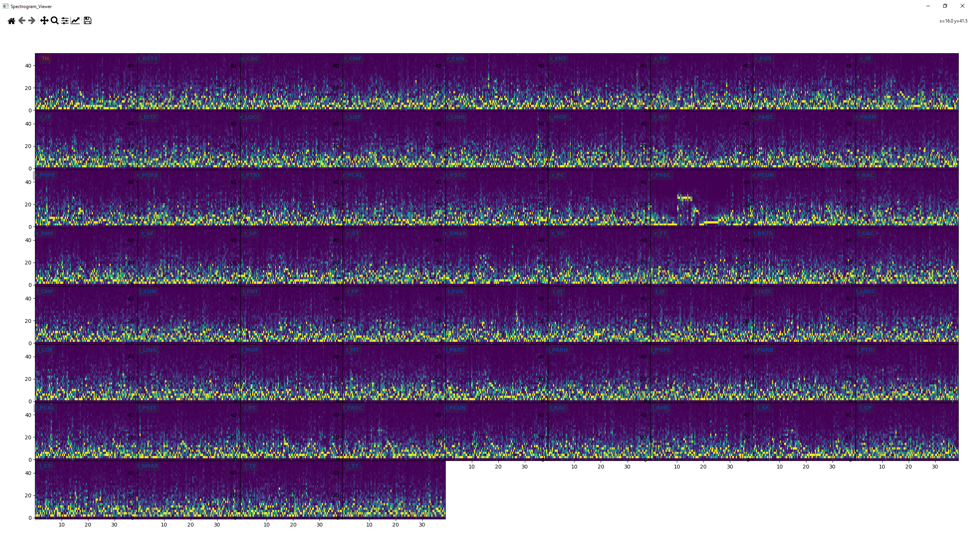

# eCOALIA documentation


## Introduction

 eCOALIA is a software package for simulating mesoscale (neuronal population) and macroscale (connected neuronal populations at the whole brain level). eCOALIA targets computational Neuroscience students, engineers, and researchers, who want to simulate EEG signals with a neurophysiologically grounded neural mass (NMM) as introduced in ([Koksal-Ersoz et al. 2022](https://iopscience.iop.org/article/10.1088/1741-2552/ac8fb4); [Wendling et al. 2024](https://doi.org/10.1016/j.clinph.2024.03.006)). The software package requires basic coding skills in Python. 

## Installation and Setup

As the software package reassembles the Python scripts necessary for simulations and visualization.
, Iit does not require installation but a python environment with available modules given. 
```
PyQt6 >= 6.6.1
Numpy >= 1.23.5
Scipy >= 1.10.1
matplotlib >= 3.8.3
vtk >= 9.2.6 
``` 

## Getting Started

The package can be cloned from the GitLab link : https://github.com/ymmx2/eCOALIA.

## Functionality Guide

### Model initialization

A model is initialized with the function ```Cortex_Model_NeoNMM.Cortex(Nb_NMM = number_of_NMMs)``` that creates a model with a number of neuronal populations ```(number_of_NMMs)```  based on the model file Model_NeoMNN.py where model equations, variables, parameters and their default values, output signals are defined.  
User can load a previously saved simulation file in txt format using the function ```LoadSimul()``` as
```Model, List_Stim, List_ParamEvol = LoadSimul(FilePath=SaveFile_Name, Model=Model) ```or create from scratch. For the latter, the model will be initialized with the default parameter values and connectivity matrices as defined in Model_NeoMNN.py. Figure 1 shows an example of the latter case where connectivity matrices are modified after creating the model. 

```python
# create the model
number_of_NMM = 2
Model = Cortex_Model_NeoNMM.Cortex(Nb_NMM=number_of_NMM)

List_Stim = []
List_ParamEvol = []
Cm_P_P = np.random.rand(number_of_NMM, number_of_NMM)
Cm_P_I1 = np.random.rand(number_of_NMM, number_of_NMM)
Cm_P_I2 = np.random.rand(number_of_NMM, number_of_NMM)
Cm_P_I3 = np.random.rand(number_of_NMM, number_of_NMM)
Cm_P_I4 = np.random.rand(number_of_NMM, number_of_NMM)
DelayMat  = np.random.rand(number_of_NMM, number_of_NMM)
Model.set_connectivityMat([Cm_P_P,Cm_P_I1,Cm_P_I2,Cm_P_I3,Cm_P_I4,DelayMat])

```

Eventually, new model classes can be introduced by changing model equations and all dependencies under the condition of respecting the structure of the model file. 

### Parameter modifications
Model parameters can be modified in a static manner, meaning that they remain constant during all simulation. In Figure 2 parameter A of the neural population 0 is fixed to 10. 
```
# Modify the model paramameters in a static manne
Model.pop.A[0] = 10 # modify one parameter for one NMM
```

Model parameters can vary during a simulation with the module class ```ParamEvolClass()```. For each group of parameter variation, a class should be created (e.g. ```myParamEvol = ParamEvolClass()```) and appended to the list of parameter evolutions as ```List_ParamEvol.append(myParamEvol)```.
The software allows to vary several parameters of different neural populations at different time points using different interpolation methods available in ```scipy.interpolate.interp1d``` class; namely linear, nearest, nearest-up, zero, slinear, quadratic, cubic, previous, or next. For each variation, time points and parameter values at each time point should be defined. In the example in Figure 3, the parameter A of the neural populations i={0,1,2} varies linearly at time points t={0,10,20} and values A={0,5,2}, while  the parameter G of the neural population i={5} varies quadratically at time points t={0,6,15} and values G={5,25,10}. Parameter variations are visualized by calling function ```Plot_Generate_ParamEvol(List_ParamEvol)``` (see Section Visualizing parameter evolution and stimulation signal).

```python
    ### Modify model parameters dynamically:
    myParamEvol = ParamEvolClass()
    myParamEvol.NMM = [24] # NMM number where the evolution will be applied
    myParamEvol.Name = 'CPI2' # The name of the parameter that will be updated
    myParamEvol.time = [0.0, 10.0, 11.0, 15.0, 30.0] # time points
    myParamEvol.val  = [55.0, 35.0, 10.0, 10.0, 55.0]	 # value of the parameter for each time points
    myParamEvol.typeinterp = 'linear'   # The type of interpolation that will be done in between specified time points
    List_ParamEvol.append(myParamEvol)
    
    myParamEvol = ParamEvolClass()
    myParamEvol.NMM = [24] # NMM number where the evolution will be applied
    myParamEvol.Name = 'Ba' # The name of the parameter that will be updated
    myParamEvol.time = [0.0, 10.0, 11.0, 25.0, 30.0]	 # time points
    myParamEvol.val  = [19.0, 19.0, 2.0, 5.0, 19.0]	 # value of the parameter for each time points
    myParamEvol.typeinterp = 'linear'   # The type of interpolation that will be done in between specified time points
    List_ParamEvol.append(myParamEvol)
```



Figure 1. Dynamic parameter modification and visualization.

### Parameter modifications

A stimulation signal can be introduced with the class ```stim_sig()```. 
A class should be created (e.g. ```myStim = stim_sig()```) and appended to the stimulation signal list 
(e.g. ```List_Stim.append(myStim)``` for each stimulation type. Stimulation signal can have different forms
such as constant, sinusoidal, square wave, sawtooth, etc., and each of them requires a specific parameter
set (Table 1). User should define one or several neural populations and the time window during which stimulation
will be applied. The stimulation signal can be modulated either the mean membrane voltage (before the transfer function)
or to post-synaptic potentials (after the transfer function) by setting 
```Pre_Post = False``` or ```Pre_Post = True```, respectively. The function Plot_Generate_Stim_signal(```List_Stim, model=Model```) 
displays the time evolution of the stimulation signals for each population in the model 
(see Section Visualizing parameter evolution and stimulation signal).

 Table 1. Stimulation types and required parameters

|     Type of the stimulation                 |     Required parameters and acronyms                                                                         |   |
|---------------------------------------------|--------------------------------------------------------------------------------------------------------------|---|
|     For all types                           |     Starting time (t),   end time (tend)                                                                     |   |
|     Constant                                |     Amplitude (A)                                                                                            |   |
|     Sinus,   Square, Sawtooth, Triangle     |     Amplitude (A),   frequency (f0), phase (phi)                                                             |   |
|     Ramp                                    |     Starting amplitude   (A), end amplitude (Aend)                                                           |   |
|     Sinus Ramp                              |     Starting amplitude   (A), end amplitude (Aend), frequency (f0), phase (phi)                              |   |
|     Square   Pulse Biphasic                 |     Amplitude (A),   frequency (f0), phase (phi), pulse width (pulsewidth)                                   |   |
|     Chirp                                   |     Amplitude (A),   starting frequency (f0), end frequency (f1), phase (phi)                                |   |
|     Chirp   Pulse                           |     Amplitude (A),   starting frequency (f0), end frequency (f1), phase (phi), pulse width   (pulsewidth)    |   |
|     Chirp   Pulse Biphasic                  |     Amplitude (A),   starting frequency (f0), end frequency (f1), phase (phi), pulse width   (pulsewidth)    |   |
|     Square   Pulse Rand                     |     Amplitude (A),   frequency (f0), phase (phi), pulse width (pulsewidth)                                   |   |
|     Square   Pulse Biphasic Rand            |     Amplitude (A),   frequency (f0), phase (phi), pulse width (pulsewidth)                                   |   |

 Figure 2 demonstrates an example where a “Square Pulse Biphasic” 
 signal of amplitude A=1 arbitrary units, frequency f0 = 2Hz, pulse width 0.001 sec
 is applied to the neural population i={0} between t=[0 sec,10 sec], and “Chirp” signal 
 of amplitude A = 1 arbitrary units, frequency increasing from f0 = 1Hz to f1 = 10Hz, 
 phase  phi = 0.1 radius is applied to the neural populations i={1,2} between t=[0 sec,20 sec].
 Simulation signals are factorized in the model file before begin applied to excitatory and inhibitory subpopulations. 


```python
    myStim = stim_sig()
    myStim.kind = 'Square Pulse Biphasic' #kind of stimulation
    myStim.times = 0. # Time the stimulation will start, every stimulation need this value
    myStim.timee = 10. # Time the stimulation will end, every stimulation need this value
    myStim.A = 1. # magnitude of the stimulation, every stimulation need this value
    myStim.f0 = 2. # Frequency of the stimulation
    myStim.phi = 0.0 # Phase of the stimulation in rd
    myStim.pulsewidth = 0.001 # length of the stimulation pulse
    myStim.pop = [0] # Label of the NMM where the stimulation will be applyed
    myStim.Fs = 1024 # Frequency for ploting the stimulation signals
    List_Stim.append(myStim)
    
    
    myStim = stim_sig()
    myStim.kind = 'Chirp' #kind of stimulation
    myStim.times = 0. # Time the stimulation will start, every stimulation need this value
    myStim.timee = 20. # Time the stimulation will end, every stimulation need this value
    myStim.A = 1. # magnitude of the stimulation, every stimulation need this value
    myStim.f0 = 1. # Frequency of the stimulation
    myStim.f1 = 10. # Frequency of the stimulation
    myStim.phi = 0.1 # Phase of the stimulation in rd
    myStim.pop = [1, 2] # Label of the NMM where the stimulation will be applyed
    myStim.Fs = 1024 # Frequency for ploting the stimulation signals
    List_Stim.append(myStim)
```


### Save

Model, parameter values and evolutions, stimulation signal can be saved in txt 
format using the function Save_Simulation() that takes the file name (fileName), 
list containing the stimulation signal (stim), 
list containing the parameter evolution (evol) and model (model) as arguments. 

```python
    SaveFile_Name = r'SaveFiles/single_node_simulation.txt'
    Save_Simulation(fileName=SaveFile_Name,stim=List_Stim,evol=List_ParamEvol ,model=Model)
```

### Numerical integration

After defining the model, parameters, parameter evolutions, stimulation signals, 
simulation time T, and numerical integration time step ```Fs```, numerical integration 
can be launched by calling the function ```Compute_Time()``` of the Model class. 
The ```Compute_Time()``` function returns local field potentials (LFP), time points (tp),
firing rates of the subpopulations (FR), postsynaptic potentials (PSPs), 
and user-selected extra signals (ESs) as outputs (Figure 6). If a delayed 
interaction matrix is included in the model, then the function ```Compute_Time_with_delay()```,
which takes the same arguments as ```Compute_Time()```, should be used. 
The numerical integration follows the Euler-Maruyama method. 

```python
    LFPs, tp, Pulses, PSPs, ESs = Model.Compute_Time(T, Fs, Stim = List_Stim,
                                                   List_ParamEvol = List_ParamEvol,
                                                   Pre_Post = Pre_Post)
```

### Signal Filtering

eCOALIA calls the scipy.signal module for filtering the simulated signals with the 
function ```signalfilter_EEG()```, which takes the signal to be filtered, numerical 
integration step, filter order, lower and upper bounds. Example in Figure 7 uses
a band pass filter. The other available filters are low pass (‘lowpass’),
high pass (‘highpass’) and band stop (‘bandstop’).  

```python
    #Fitering
    LFPs = signalfilter_EEG(LFPs, Fs, ftype='bandpass', order=3, lowcut=1, highcut=80 )
```

### EEG computation

eCOALIA packs lead field 8 different lead field matrices that link the Desikan atlas of 
66 cortical regions to N_E={21,32,65,110,131,200,256,257} number of EEG electrode contacts. 
The files corresponding to the lead field matrices and EEG electrode names are given in Table 2.
Functions ```LeadField = LoadLeadfield(FileName = FileName_Leadfield)``` and ```EEG_Names,
EEG_Color = get_electrode(filename=FileName_Electrode)``` load the lead field matrix 
and electrode names, respectively. The forward problem is solved by multiplying the 
lead field matrix with the neocortical source activity (excluding the activity of the first NMM (NMM[0]),
which corresponds to the thalamus).

Table 2. Correspondence between the lead field and EEG electrode names files. 


|     Number of EEG contacts    |     Lead field name (FileName_Leadfield)            |     EEG electrode names (FileName_Electrode)                 |
|-------------------------------|-----------------------------------------------------|--------------------------------------------------------------|
|     21                        |     "Ressources/LeadField_66x21_DESIKAN_RL.mat"     |     "Ressources/EEG_ElectrodeNames_21_DESIKAN_66_RL.txt"     |
|     32                        |     "Ressources/LeadField_66x32_DESIKAN_RL.mat"     |     "Ressources/EEG_ElectrodeNames_32_DESIKAN_66_RL.txt"     |
|     65                        |     "Ressources/LeadField_66x65_DESIKAN_RL.mat"     |     "Ressources/EEG_ElectrodeNames_65_DESIKAN_66_RL.txt"     |
|     110                       |     "Ressources/LeadField_66x110_DESIKAN_RL.mat"    |     "Ressources/EEG_ElectrodeNames_110_DESIKAN_66_RL.txt"    |
|     131                       |     "Ressources/LeadField_66x131_DESIKAN_RL.mat"    |     "Ressources/EEG_ElectrodeNames_131_DESIKAN_66_RL.txt"    |
|     200                       |     "Ressources/LeadField_66x200_DESIKAN_RL.mat"    |     "Ressources/EEG_ElectrodeNames_200_DESIKAN_66_RL.txt"    |
|     256                       |     "Ressources/LeadField_66x256_DESIKAN_RL.mat"    |     "Ressources/EEG_ElectrodeNames_256_DESIKAN_66_RL.txt"    |
|     257                       |     "Ressources/LeadField_66x257_DESIKAN_RL.mat"    |     "Ressources/EEG_ElectrodeNames_257_DESIKAN_66_RL.txt"    |


## Visualisation

eCOALIA uses the PyQt6 module for the visualization and then need to call ```app = QApplication(sys.argv) ```
before calling the visualization functions. Then, the user calls the ```sys.exit(app.exec()) ```
after all visualization function definitions.
eCOALIA incorporates different modules for different visualization purposes as explained in the subsequent subsections. 

### Module EEG_Viewer

An axis created by the module ```EEG_Viewer()``` visualizes the time series of LFP and EEG signals, as exemplified for the LFP 
```python
    app = QApplication(sys.argv)
    ex = EEG_Viewer( )
    ex.setWindowTitle('LFPs')
    ex.update(LFPs, Model.popColor, Model.popName, tp)
    ex.showMaximized()
```

In this example, a class called “EEG_viewer” is createdinstantiated and called “ex”. 
The window title is set to “LFPs” with the function ```setWindowTitle()```. The signal (LFP), 
line colors (```Model.popColor```), signal names (```Model.popName```) and time points (tp) are passed 
to the function update(). The function showMaximized() creates a window maximized to the screen size. 

The generated window (Figure 3) contains the following options:
* Gain: adjusts signal amplitude 
* Window: displayed time window on one page
* Vertical spacing: vertical distance between the signals
* Linewidth: sets the line width in points

Press the Enter Key to apply the modification.



Figure 3. Window generated by EEG_View().

### Module Spectrogram

An axis created by the module ```Spectrogram_Viewer()``` visualizes the spectrogram of time signals, such as LFP and EEG signals, 
using the ```scipy.signal.spectrogram()``` function as exemplified in  

```python 
    ex4 = Spectrogram_Viewer( )
    ex4.setWindowTitle('Spectrogram_Viewer')
    ex4.update(LFPs=LFPs,Names=Model.popName, Fs=Fs, plot1D2D=False, cut=1 , Fmax=50, Fseg=0.5,  Colors=Model.popColor)
    ex4.showMaximized()
```

The function update() takes the following arguments:
* LFPs: signals of which the spectrograms will be computed, e.g. LFPs, EEG.
* Names: signals names given as a list. This list is defined in Model.popName for LFPs and EEG_Names for EEG signals. 
* Fs: sampling frequency of the signal, which is equivalent to the time step used for the numerical integration. 
* plot1D2D: if True, the spectrograms will be shown in a 1-dimentional grid; if False in a 2-dimentional grid. We recommend plot1D2D = False.
* cut: duration (in seconds) of the initial segment on the time series to be omitted. 
* Fmax: maximum frequency on the y-axis. 
* Fseg: length of each segment. See scipy.signal.spectrogram() documentation for details.
* Colors: signals colors given as a list. This list is defined in Model.popColor for LFPs and EEG_Color for EEG signals.

Figure 4 shows the spectrograms of the LFP signals of 67 NMMs. Model names with respective color codes are annotated on the upper left corner of each panel.



### Module Mesh3DView

The module Mesh3DView() creates an interactive axis where the source activity (LFP signals) 
is projected on an anatomical 3-dimentional cortical model with the EEG electrode contacts 
are positioned around it (Figure 5). User can manipulate this 3-dimentional object to change 
to angle, introduce frequency or amplitude based filters, play the temporal evolution of the
simulated activity on the cortical surface etc. The available options are listed below:

* Display region names: displays electrode names
* Analysis type: The source activity is highlighted with a color code compute from energy either in frequency domain or amplitude domain.
   * Frequency-based analysis: the energy of the LFP time series are computed within the following frequency bands: 
        * Delta [0-4Hz[, 
        * Theta [4-8Hz[, 
        * Alpha [8-12Hz[, 
        * Beta [12-30Hz[,
        * Gamma [30Hz-. 
        * The option Without [0Hz- computes the global energy.
    * Amplitude-based analysis: Amplitude_Mean, Amplitude_Max, Amplitude_RMS
* Window (s): time window during which the chosen signal analysis will be applied
* Color maps: ['viridis', 'plasma', 'inferno', 'magma', 'cividis', 'Greys_r', 'Purples_r', 'Blues_r', 'Greens_r', 'Oranges_r', 'Reds_r', 'YlOrBr_r', 'YlOrRd_r', 'OrRd_r', 'PuRd_r', 'RdPu_r', 'BuPu_r',            'GnBu_r', 'PuBu_r', 'YlGnBu_r', 'PuBuGn_r', 'BuGn_r', 'YlGn_r', 'binary_r', 'gist_yarg_r', 'gist_gray', 'gray', 'bone', 'pink', 'spring', 'summer', 'autumn', 'winter', 'cool', 'Wistia', 'hot', 'afmhot', 'gist_heat', 'copper', 'PiYG', 'PRGn', 'BrBG', 'PuOr', 'RdGy', 'RdBu',  'RdYlBu', 'RdYlGn', 'Spectral', 'coolwarm', 'bwr', 'seismic']
* Brightness  : set the brightness of the mesh
* Gamma : apply a gamma law on the color
* Opacity  : set the transparency of the mesh
* Threshold  : apply a low and high thresholding on the color

After changing any of the options regarding analysis, window and color map, 
the user should click on the “Update color” button.

Play/pause button displays the activity in sliding window.


Figure 5. Window generated by Mesh3DView

### Visualizing parameter evolution and stimulation signal

The function ```Plot_Generate_ParamEvol()```, which takes the list of parameter evolution 
(e.g. ```List_ParamEvol```) as an argument, visualizes the user defined variation of the model 
parameters (see Parameter modifications) as in Figure 3. 
The function ```Plot_Generate_Stim_signal()```, which takes the list of stimulation
signals applied to neuronal populations and the model (e.g. ```List_Stim, model=Model```) 
as arguments, visualizes the user defined stimulation signals (see Stimulation) by creating 
a 2-dimentional array of axis panels as in Figure 1.


# Practical example 1: running from a previously saved simulation file

This example shows how to construct a python script for loading and running a previously 
saved simulation file where only one NMM was simulated and saved. We also show how to
display other signals than LFPs, which are also the outputs of the numerical simulation. 
Since there is only on NMM, the EEG signals will not be computed. This example file does 
not include any parameter evolution or stimulation signal. Therefore, the functions 
```Plot_Generate_ParamEvol()``` and ```Plot_Generate_Stim_signal()``` will not be called.

* General structure of the script:

```python 
#make import
from PyQt6.QtWidgets import QApplication
from PackageSources.Model import Cortex_Model_NeoNMM
from PackageSources.Computation.Loading import LoadSimul, Save_Simulation
from PackageSources.Computation.Generate_Signal import Plot_Generate_ParamEvol, Plot_Generate_Stim_signal
from PackageSources.Computation.Filter import signalfilter_EEG
from PackageSources.Display.EEG_Viewer import EEG_Viewer
from PackageSources.Display.Spectrogram import Spectrogram_Viewer
from PackageSources.Computation.Classes import stim_sig, ParamEvolClass
import sys
import numpy as np


def main():... 


if __name__ == '__main__':
    main()
``` 

* Function main()

    * Create the model with the number of NMMs: 
    ```python 
    #  create the model
    Model = Cortex_Model_NeoNMM.Cortex(Nb_NMM=1)
    ```
    * Load the saved simulation file under « SaveFiles » directory
    ```python 
    #load a file
    SaveFile_Name = r'SaveFiles/1NMM_alpha.txt'
    Model, List_Stim, List_ParamEvol = LoadSimul(FilePath=SaveFile_Name, Model=Model)
    ```
    * Define numerical integration parameters
    ```python 
    # Parameter of numerical integration
    Fs = 1024
    T = 10
    ```
    * Run numerical integration
    ```python 
    # Numerical integration 
    LFPs, tp, Pulses, PSPs, ESs = Model.Compute_Time(T, Fs, Stim = List_Stim,
                                                   List_ParamEvol = List_ParamEvol,
                                                   Pre_Post = False)
    ```
    * If necessary, filter LFP signal for a clearer visualization
    ```python 
    #Fitering
    LFPs = signalfilter_EEG(LFPs, Fs, ftype='bandpass', order=3, lowcut=1, highcut=80 )
    ```
    * Create a QT application for displaying the results
    ```python 
      app = QApplication(sys.argv)
    ```
    * Call EEG_Viewer() for displaying LFP
    ```python 
    # Display LFP
    ex0 = EEG_Viewer()
    ex0.setWindowTitle('LFPs')
    ex0.update(LFPs, Model.popColor, Model.popName, tp)
    ex0.showMaximized()
    ```
    * Display the firing rates of each neuronal subpopulation recorded under the variable “Pulses”. Notice that signal names are exported from Model.get_Pulse_Names(), and color map from matplotlib.colors  module. 
    ```python 
    # Display Firing Rates
    import matplotlib.colors as colors
    colors_list = list(colors._colors_full_map.values())
    ex1 = EEG_Viewer( )
    ex1.setWindowTitle('Pulses')
    ex1.update(Pulses[0], colors_list[0:Pulses.shape[1]], Model.get_Pulse_Names(), tp )
    ex1.showMaximized()
    ```
    * Sum of the post-synaptic potentials received by the subpopulation of pyramidal cells (also referred as membrane potential) is saved as an extra signal (ESs). The function EEG_View() is called for visualization.
    ```python 
    # Display membrane perturbation
    ex2 = EEG_Viewer( )
    ex2.setWindowTitle('Vm(t)')
    ex2.update(ESs[0], Model.popColor, Model.popName, tp)
    ex2.showMaximized()
    ```
    * Spectrogram of LFP is computed and display using the function Spectrogram_Viewer()
    ```python 
    # Display spectrogram
    ex3 = Spectrogram_Viewer( )
    ex3.setWindowTitle('Spectrogram_Viewer')
    ex3.update(LFPs=LFPs,Names=Model.popName, Fs=Fs, plot1D2D=False, cut=1 , Fmax=50, Fseg=0.5,  Colors=Model.popColor)
    ex3.showMaximized()
    ```
    * The function main() ends by executing Qt application
    ```python 
      sys.exit(app.exec())
    ``` 

Running this scripts yields four windows as in Figure 6.




Figure 6. Displayed signals after running Practical example 1.

# Practical Example 2: simulating a seizure-like activity 

In this example, we modify one of the already available scripts on the GitHub page,
which is “67_spikewave_2.txt”. The model contains 67 regions, of which the first one corresponds 
to thalamus and the rest to neocortical regions associated to the Desikan atlas. The region rPREC 
undergoes interictal spike-wave discharges. We change three parameters of the corresponding NMM (NMM[24]) 
to get a transition from interictal phase with spike-wave discharges to an ictal phase followed by a seizure
termination. This transition is obtained by fixing the parameter CI1CI1 to 0 during whole simulation, and
by varying the parameters PCI2 and Ba dynamically. 

The general structure of the script follows the one of Practical example 1:
running from a previously saved simulation file. Below we detail parameter variations 
and forward solution. For the illustrative purposes, numerical integration accounts for 
the neocortical structural delay matrix. Since the subcortical regions as thalamus do not
contribute to the EEG signals, the lead field matrix projects the 66 neocortical regions to EGG electrodes. 
* Function main()
    * Create a model with 67 regions, (1 for thalamus, 66 for neocortex):
    ```python  
    #create the model
    Model = Cortex_Model_NeoNMM.Cortex(Nb_NMM=67)
    ``` 
    * Load the saved simulation file under « SaveFiles » directory:
    ```python  
    #load a file
    SaveFile_Name = r'SaveFiles/67NMM_spikewave_2.txt'
    Model,List_Stim, List_ParamEvol = LoadSimul(FilePath=SaveFile_Name, Model=Model)
    ``` 
    * Define numerical integration paramters:
    ```python  
    #parameter of the simulation
    Fs = 1024
    T = 40 
    ``` 
    * Change the value of CI1CI1 of NMM[24]:
    ```python  
    ### Modify parameter statically
    Model.pop.CI1I1[24] = 0 # modify one parameter for NMM[24]
    ``` 
    * Define how the parameter PCI2 and Ba change during stimulation:
    ```python  
    ### Modify model parameters dynamically:
    myParamEvol = ParamEvolClass()
    myParamEvol.NMM = [24] # NMM number where the evolution will be applied
    myParamEvol.Name = 'CPI2' # The name of the parameter that will be updated
    myParamEvol.time = [0.0, 10.0, 11.0, 15.0, 30.0] # time points
    myParamEvol.val  = [55.0, 35.0, 10.0, 10.0, 55.0]	 # value of the parameter for each time points
    myParamEvol.typeinterp = 'linear'   # The type of interpolation that will be done in between specified time points
    List_ParamEvol.append(myParamEvol)
    
    myParamEvol = ParamEvolClass()
    myParamEvol.NMM = [24] # NMM number where the evolution will be applied
    myParamEvol.Name = 'Ba' # The name of the parameter that will be updated
    myParamEvol.time = [0.0, 10.0, 11.0, 25.0, 30.0]	 # time points
    myParamEvol.val  = [19.0, 19.0, 2.0, 5.0, 19.0]	 # value of the parameter for each time points
    myParamEvol.typeinterp = 'linear'   # The type of interpolation that will be done in between specified time points
    List_ParamEvol.append(myParamEvol)
    ``` 
    * Save the model,  parameter evolution, stimulation to a file for future use:
    ```python  
    # Save a simulation file
    SaveFile_Name = r'SaveFiles/67NMM_interictal_to_ictal.txt'
    Save_Simulation(fileName=SaveFile_Name, stim=List_Stim, evol=List_ParamEvol, model=Model)
    ``` 
    * Run numerical integration by takin into account the cortical delay matrix using the function ```Compute_Time_with_delay()```
    ```python  
    # Integrate delayed system equations 
    LFPs, tp, Pulses, PPSs, ESs = Model.Compute_Time_with_delay(T, Fs, 
                                                  Stim = List_Stim,
                                                   List_ParamEvol = List_ParamEvol,
                                                   Pre_Post = False)
    ``` 
    * Choose the montage (number of EEG contacts), load the corresponding lead field and electrode name files. 
    ```python  
    # Choose the montage (number of electrodes) and corresponding 
    montage = 32
    if montage == 21:
        FileName_Leadfield = r"Ressources/LeadField_66x21_DESIKAN_RL.mat"
        FileName_Electrode = r"Ressources/EEG_ElectrodeNames_21_DESIKAN_66_RL.txt"
    elif montage ==32:
        FileName_Leadfield = r"Ressources/LeadField_66x32_DESIKAN_RL.mat"
        FileName_Electrode = r"Ressources/EEG_ElectrodeNames_32_DESIKAN_66_RL.txt"
    elif montage ==65:
        FileName_Leadfield = r"Ressources/LeadField_66x65_DESIKAN_RL.mat"
        FileName_Electrode = r"Ressources/EEG_ElectrodeNames_65_DESIKAN_66_RL.txt"
    elif montage ==110:
        FileName_Leadfield = r"Ressources/LeadField_66x110_DESIKAN_RL.mat"
        FileName_Electrode = r"Ressources/EEG_ElectrodeNames_110_DESIKAN_66_RL.txt"
    elif montage ==131:
        FileName_Leadfield = r"Ressources/LeadField_66x131_DESIKAN_RL.mat"
        FileName_Electrode = r"Ressources/EEG_ElectrodeNames_131_DESIKAN_66_RL.txt"
    elif montage ==200:
        FileName_Leadfield = r"Ressources/LeadField_66x200_DESIKAN_RL.mat"
        FileName_Electrode = r"Ressources/EEG_ElectrodeNames_200_DESIKAN_66_RL.txt"
    elif montage ==256:
        FileName_Leadfield = r"Ressources/LeadField_66x256_DESIKAN_RL.mat"
        FileName_Electrode = r"Ressources/EEG_ElectrodeNames_256_DESIKAN_66_RL.txt"
    elif montage ==257:
        FileName_Leadfield = r"Ressources/LeadField_66x257_DESIKAN_RL.mat"
        FileName_Electrode = r"Ressources/EEG_ElectrodeNames_257_DESIKAN_66_RL.txt"
    LeadField = LoadLeadfield(FileName = FileName_Leadfield)

    EEG_Names, EEG_Color = get_electrode(filename=FileName_Electrode)
    ``` 
    * Apply the lead field to the LFP signals of the neocortical sources (ignore thalamus).
    ```python  
    #Apply the lead field with the correct sources
    EEG = np.dot(LeadField,  LFPs[1:,:])
    ``` 
    * Create a QT application and call functions for displaying LFP, LFP spectrogram, 3D mesh, EEG and parameter evolution. 
    ```python  
    # Create a QT app for the displays
    app = QApplication(sys.argv)
    
    # Display LFP signals
    ex1 = EEG_Viewer( )
    ex1.setWindowTitle('LFPs')
    ex1.update(LFPs, Model.popColor, Model.popName, tp)
    ex1.showMaximized()
    
    # Display LFP spectrogram 
    ex2 = Spectrogram_Viewer( )
    ex2.setWindowTitle('Spectrogram_Viewer')
    ex2.update(LFPs=LFPs, Names=Model.popName, Fs=Fs, 
               plot1D2D=False, cut=1 , Fmax=50, Fseg=0.5,  Colors=Model.popColor)
    ex2.showMaximized()
    
    # Display the 3D anatomical model with the source activity and electrodes
    ex3 = Mesh_SimpleView(parent=app, LFPs= LFPs[1:,:] , Fs=Fs, 
                          Names=Model.popName,Colors=Model.popColor, FileName = FileName_Electrode)
    ex3.showMaximized()

    # Display EEG signals
    ex4 = EEG_Viewer( )
    ex4.setWindowTitle('EEG')
    ex4.update(EEG, EEG_Color, EEG_Names, tp)
    ex4.showMaximized()

    # Display dynamic parameters
    Plot_Generate_ParamEvol(List_ParamEvol)
    
    # Display stimulation signal if any
    Plot_Generate_Stim_signal(List_Stim, model=Model)

    sys.exit(app.exec())

    ``` 




Figure 7. Displayed signals after running Practical example 2. Notice the difference in the spectrogram in the panel r-PREC.


